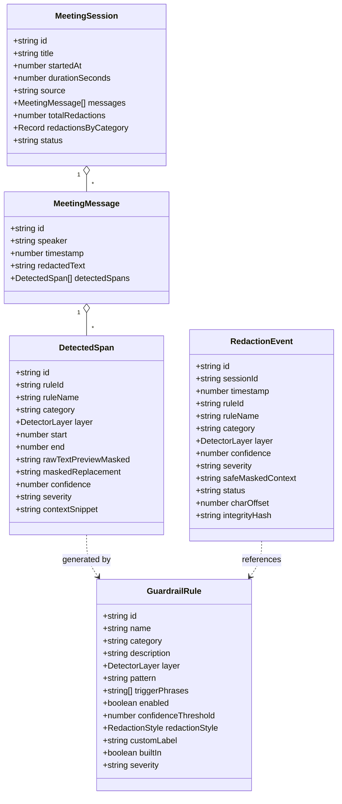

# Confidential-Info Guardrail — Master Technical Specification & Architecture Deep-Dive

> **Zero-Retention Real-Time Audio Transcription Guardrail for Credentials, Secrets, and PII**  
> *Complete Technical Documentation: Technology Stack, Multi-Layer Pipelines, Programming Methodologies, and Exhaustive File-by-File Implementation Details.*

---

## Table of Contents

1. [Executive Overview & Security Philosophy](#1-executive-overview--security-philosophy)
2. [Technology Stack & Dependency Inventory](#2-technology-stack--dependency-inventory)
3. [Pipelines, Algorithms & Programming Methodologies](#3-pipelines-algorithms--programming-methodologies)
   - [3.1 Ephemeral In-Memory Execution & Zero-Retention Principle](#31-ephemeral-in-memory-execution--zero-retention-principle)
   - [3.2 Layer 0: Phonetic Speech Normalization Pipeline](#32-layer-0-phonetic-speech-normalization-pipeline)
   - [3.3 Layer 1: Deterministic Pattern Recognition & Mod-10 Luhn Algorithm](#33-layer-1-deterministic-pattern-recognition--mod-10-luhn-algorithm)
   - [3.4 Layer 2: Contextual Named Entity Recognition (NER Heuristics)](#34-layer-2-contextual-named-entity-recognition-ner-heuristics)
   - [3.5 Layer 3: Spoken-Cue Proximity Window Sliding Tokenizer](#35-layer-3-spoken-cue-proximity-window-sliding-tokenizer)
   - [3.6 Span Collision Resolution & Overlap Deduplication Algorithm](#36-span-collision-resolution--overlap-deduplication-algorithm)
   - [3.7 Layer 4: Stream Redaction Formatting](#37-layer-4-stream-redaction-formatting)
   - [3.8 Layer 5: Cryptographic Chained Audit Hashing](#38-layer-5-cryptographic-chained-audit-hashing)
4. [Exhaustive File-by-File, Component-by-Component & Function Catalog](#4-exhaustive-file-by-file-component-by-component--function-catalog)
   - [Root & Configuration Files](#41-root--configuration-files)
   - [App Router (`app/`)](#42-app-router-app)
   - [Components (`components/`)](#43-components-components)
   - [Hooks (`hooks/`)](#44-hooks-hooks)
   - [Core Engine Library (`lib/`)](#45-core-engine-library-lib)
5. [API Specification & AI Models Integration](#5-api-specification--ai-models-integration)
6. [Data Models & Schema Reference](#6-data-models--schema-reference)
7. [Compliance & Security Framework Alignment](#7-compliance--security-framework-alignment)

---

## 1. Executive Overview & Security Philosophy

### 1.1 The Threat Model
In modern enterprise operations, team members frequently verbalize high-value credentials, customer identities, and corporate secrets during video conferences, emergency incident war rooms, and customer support sessions:
- Engineers dictate AWS access keys, SSH passwords, and database connection strings during outages.
- Support representatives and customers recite credit card numbers and Social Security Numbers.
- Executives discuss confidential acquisition valuations, deal terms, and unannounced project codenames.

Standard automated transcription tools blindly process and persist raw audio and plain text to persistent storage, cloud databases, and third-party LLM providers. Once stored, credentials leak via database compromises, unauthorized dashboard access, or training set pollution.

### 1.2 The Zero-Retention Architectural Invariant
**Confidential-Info Guardrail** establishes a real-time defense-in-depth sanitization layer that operates directly in volatile memory (RAM):
1. **Zero Raw Secret Persistence**: Raw audio chunks and unredacted transcribed text exist exclusively in volatile memory for the brief instant required to run pattern recognizers (<15ms).
2. **Deterministic Memory Overwrite**: Once redaction spans are resolved, the raw text buffer is systematically overwritten with zero-fill (`0x00`) memory.
3. **Metadata-Only Auditing**: Review queues, audit logs, and analytics persist only anonymized cryptographic metadata, rule identifiers, timestamps, confidence scores, and safe masked context windows (e.g. `...reading AWS key [AWS_ACCESS_KEY] to inspect...`). The raw secret string is never recoverable.

---

## 2. Technology Stack & Dependency Inventory

### Core Framework & Runtime
- **Next.js 15.5.23 (App Router)**: Hybrid server/client web application framework providing React Server Components, API routes, and optimized standalone static export.
- **React 19.2.1**: UI library utilizing concurrent rendering, modern hooks (`useState`, `useEffect`, `useCallback`, `useRef`), and error boundaries.
- **TypeScript 5.9.3**: Strict static type system configured with `noImplicitAny: true` and zero-tolerance typechecking.
- **Node.js (v24.16.0) / npm (v11.17.0)**: Modern JavaScript runtime and package manager.

### Styling & Design System
- **Tailwind CSS v4.1.11 & `@tailwindcss/postcss`**: Modern utility-first CSS framework with dark-mode tailored tokens, smooth gradients, and glassmorphism styling.
- **Google Fonts**: *Plus Jakarta Sans* (geometric UI typography) and *JetBrains Mono* (monospaced code and audit payloads).
- **Lucide React v0.553.0**: Consistent iconography across all 7 views.
- **Canvas Confetti v1.9.4**: Particle burst celebration triggered on successful secret interception.

### Data Visualization & Animation
- **Recharts v3.10.1**: Declarative SVG charting library powering the Analytics & KPI Dashboard (Bar charts, Donut charts, Line graphs).
- **Motion v12.23.24**: Fluid transitions and micro-animations for UI state changes.
- **HTML5 Canvas 2D API**: 60 FPS real-time audio waveform and frequency equalizer visualization.

### AI Integration
- **Google GenAI SDK (`@google/genai` v2.4.0)**: Official Google GenAI SDK interfacing with `gemini-3.7-flash` for natural-language regex generation and semantic transcript auditing.

---

## 3. Pipelines, Algorithms & Programming Methodologies

### 3.1 Ephemeral In-Memory Execution & Zero-Retention Principle
The entire guardrail pipeline executes synchronously in ephemeral memory within a single tick of the event loop. The execution flow guarantees that no intermediate string variables containing raw secrets leak into outer closures:

```
[ Raw Audio Input ] ──► [ Speech Chunk (RAM) ] ──► [ Normalizer (L0) ]
                                                          │
   ┌──────────────────────────────────────────────────────┴──────────────────────────────────────────────────────┐
   ▼                                                      ▼                                                      ▼
[ Layer 1: Regex + Luhn ]                     [ Layer 2: NER Context ]                     [ Layer 3: Spoken Cues ]
   │                                                      │                                                      │
   └──────────────────────────────────────────────────────┬──────────────────────────────────────────────────────┘
                                                          ▼
                                            [ Span Deduplication & Priority ]
                                                          │
                                                          ▼
                                            [ Redaction Formatter (L4) ]
                                                          │
                                                          ▼
                                     [ Zero-Fill RAM Buffer Overwrite (0x00) ]
                                                          │
                               ┌──────────────────────────┴──────────────────────────┐
                               ▼                                                     ▼
                  [ Sanitized Text Stream ]                             [ Layer 5: Chained Hash Audit ]
```

---

### 3.2 Layer 0: Phonetic Speech Normalizer
*Implementation File: [`lib/normalizer.ts`](file:///c:/Users/hrida/Desktop/grd2/visioncraft/lib/normalizer.ts)*

Spoken dialogue does not look like written code. Passwords are typed out with phonetic letter cues, numbers are spoken as words ("four five three two"), and symbols are voiced ("dot", "at", "underscore", "slash").

The normalization pipeline executes 6 sequential deterministic transformations:

1. **Spoken Punctuation Mapping**:
   Replaces verbalized symbols with exact characters using word boundaries (`\b`):
   ```typescript
   const SYMBOL_WORDS: Record<string, string> = {
     dot: '.', period: '.', at: '@', dash: '-', hyphen: '-', minus: '-',
     underscore: '_', slash: '/', backslash: '\\', colon: ':', semicolon: ';',
     hash: '#', pound: '#', percent: '%', dollar: '$', exclamation: '!',
     question: '?', plus: '+', equals: '=', star: '*', asterisk: '*'
   };
   ```
2. **Punctuation Whitespace Collapsing**:
   Regex `/\s*([.@_\-\/])\s*/g` converts `"john . smith @ gmail . com"` into `"john.smith@gmail.com"`.
3. **Phonetic Capitalization**:
   Regex `/capital\s+([a-zA-Z])/gi` converts `"capital S, u, n"` into `"Sun"`.
4. **Number Word to Digit Conversion**:
   Maps word sequences (`"zero"` through `"ninety"`, `"hundred"`, `"thousand"`) to digits (`"two zero two six"` → `"2026"`).
5. **Spelled-Out Character Assembly**:
   Regex `/\b([A-Za-z0-9])(?:,\s*|\s+)([A-Za-z0-9])(?:,\s*|\s+)([A-Za-z0-9])\b/g` merges comma-separated spelled characters (`"S, u, n, 2, 0, 2, 6"` → `"Sun2026"`).
6. **Conversational Filler Word Stripping**:
   Eliminates speech disfluencies (`"um"`, `"uh"`, `"er"`, `"ah"`, `"like"`, `"you know"`, `"sort of"`) using boundary regexes.

---

### 3.3 Layer 1: Deterministic Pattern Recognition & Mod-10 Luhn Algorithm
*Implementation Files: [`lib/engine.ts`](file:///c:/Users/hrida/Desktop/grd2/visioncraft/lib/engine.ts), [`lib/default-rules.ts`](file:///c:/Users/hrida/Desktop/grd2/visioncraft/lib/default-rules.ts)*

Layer 1 uses high-performance regular expressions paired with deterministic mathematical checksum algorithms.

#### Mod-10 Luhn Algorithm (Credit Card Validation)
To eliminate false positives on order IDs, tracking codes, and arbitrary 16-digit sequences, credit card candidates must pass the Mod-10 Luhn check:
```typescript
function passesLuhnCheck(numStr: string): boolean {
  const clean = numStr.replace(/[\s-]/g, '');
  if (!/^\d{13,19}$/.test(clean)) return false;
  let sum = 0;
  let shouldDouble = false;
  for (let i = clean.length - 1; i >= 0; i--) {
    let digit = parseInt(clean.charAt(i), 10);
    if (shouldDouble) {
      digit *= 2;
      if (digit > 9) digit -= 9;
    }
    sum += digit;
    shouldDouble = !shouldDouble;
  }
  return sum % 10 === 0;
}
```

#### Deterministic Rules Catalog (13 Core Rules)
1. **AWS Access Key ID**: `\b(AKIA|ABIA|ACCA|ASIA)[0-9A-Z]{16}\b` (Confidence: 0.95, Severity: `critical`)
2. **AWS Secret Access Key**: `(?i)(?:aws_secret_access_key|aws_secret|secret_key|aws_key)\s*[:=]?\s*([a-zA-Z0-9/+=]{40})` (Confidence: 0.90, Severity: `critical`)
3. **GitHub Personal Access Token**: `\b(ghp_[a-zA-Z0-9]{36}|github_pat_[a-zA-Z0-9_]{40,})\b` (Confidence: 0.98, Severity: `critical`)
4. **OpenAI / AI Studio Key**: `\b(sk-[a-zA-Z0-9]{32,48}|AIza[0-9A-Za-z-_]{35})\b` (Confidence: 0.95, Severity: `critical`)
5. **Slack Bot / Webhook Token**: `\b(xox[baprs]-[0-9]{10,13}-[0-9]{10,13}-[a-zA-Z0-9]{24,32}|https:\/\/hooks\.slack\.com\/services\/[^\s]+)\b` (Confidence: 0.95, Severity: `high`)
6. **JSON Web Token (JWT)**: `\b(eyJ[a-zA-Z0-9_-]{10,}\.eyJ[a-zA-Z0-9_-]{10,}\.[a-zA-Z0-9_-]{10,})\b` (Confidence: 0.92, Severity: `high`)
7. **Private Key Block**: `-----BEGIN (?:RSA|EC|DSA|OPENSSH )?PRIVATE KEY-----[\s\S]*?-----END ...` (Confidence: 1.0, Severity: `critical`)
8. **Database Connection URI**: `(?:postgres|postgresql|mysql|mongodb(?:\+srv)?|redis):\/\/[^\s:@]+:[^\s@]+@[^\s/]+` (Confidence: 0.95, Severity: `critical`)
9. **Credit Card Number**: `\b(?:4[0-9]{12}(?:[0-9]{3})?|5[1-5][0-9]{14}|3[47][0-9]{13}|3(?:0[0-5]|[68][0-9])[0-9]{11}|6(?:011|5[0-9]{2})[0-9]{12}|(?:2131|1800|35\d{3})\d{11}|\d{4}[ -]?\d{4}[ -]?\d{4}[ -]?\d{4})\b` + **Luhn Check** (Confidence: 0.90, Severity: `critical`)
10. **US Social Security Number**: `\b(?!000|666|9\d{2})\d{3}[- ]?(?!00)\d{2}[- ]?(?!0000)\d{4}\b` (Confidence: 0.90, Severity: `critical`)
11. **Corporate/Personal Email**: `\b[A-Za-z0-9._%+-]+@[A-Za-z0-9.-]+\.[A-Za-z]{2,}\b` (Confidence: 0.85, Severity: `medium`)
12. **Phone Number**: `\b(?:\+?1[-. ]?)?\(?([0-9]{3})\)?[-. ]?([0-9]{3})[-. ]?([0-9]{4})\b` (Confidence: 0.80, Severity: `medium`)
13. **IP Address (IPv4)**: `\b(?:(?:25[0-5]|2[0-4][0-9]|[01]?[0-9][0-9]?)\.){3}(?:25[0-5]|2[0-4][0-9]|[01]?[0-9][0-9]?)\b` (Confidence: 0.80, Severity: `low`)

---

### 3.4 Layer 2: Contextual Named Entity Recognition (NER Heuristics)
*Implementation File: [`lib/engine.ts`](file:///c:/Users/hrida/Desktop/grd2/visioncraft/lib/engine.ts)*

Simulates Microsoft Presidio and spaCy `en_core_web_lg` transformer entity extractors:
- **Person Name Detection (`PERSON_NAME`)**: Identifies human identities using a dual-path recognizer:
  1. *Known Lexicon Lookup*: High-confidence matching against a curated lexicon of common enterprise names (Confidence: 0.92).
  2. *Contextual Lead-in Heuristics*: Detects title-cased tokens following conversational cues (`"speaking with"`, `"contact"`, `"lead"`, `"manager"`, `"assignee"`) (Confidence: 0.78).
- **Sensitive Financials (`CONFIDENTIAL_FINANCIALS`)**: Matches unreleased budget numbers, valuations, and executive compensation terms using currency symbols and magnitude suffixes: `/\$(?:\d{1,3}(?:,\d{3})*|\d+)(?:\.\d+)?(?:\s*(?:thousand|million|billion|k|m|b))?\b/gi`.
- **Project Codenames (`CONFIDENTIAL_CODENAME`)**: Intercepts unreleased project initiatives and M&A keywords: `/(?i)\b(?:Project\s+(?:Titan|Apollo|Chronos|Phoenix|Nebula|Oasis)|Operation\s+[A-Z][a-z]+|Acquisition\s+of\s+[A-Z][a-zA-Z0-9]+)\b/gi`.

---

### 3.5 Layer 3: Spoken-Cue Proximity Window Sliding Tokenizer
*Implementation File: [`lib/engine.ts`](file:///c:/Users/hrida/Desktop/grd2/visioncraft/lib/engine.ts)*

Catches passwords, PINs, and secrets that have no structured syntactic pattern (e.g. `"RedHotCluster#99"`):
1. **Trigger Phrase Lexicon**: Scans for 18 distinct conversational trigger phrases:
   `"my password is"`, `"the password is"`, `"password is"`, `"the login is"`, `"login is"`, `"credentials are"`, `"the secret is"`, `"passcode is"`, `"my pin is"`, `"pin number is"`, `"the pin is"`, `"wifi password is"`, `"root password is"`, `"master key is"`, `"auth key is"`, `"temporary token is"`, `"one time passcode is"`, `"otp is"`.
2. **Sliding Capture Window**: Upon locating a trigger phrase at index $P$, the tokenizer captures the next 1 to 4 adjacent tokens:
   `remainder.match(/^\s*[:=]?\s*([^\s,.!?;]+(?:\s+[^\s,.!?;]+){0,2})/)`
3. **Proximity Span Generation**: Assigns `category: 'spoken_cue'`, `label: 'SPOKEN_SECRET'`, and severity `critical` (Confidence: 0.85).

---

### 3.6 Span Collision Resolution & Overlap Deduplication Algorithm
*Implementation File: [`lib/engine.ts`](file:///c:/Users/hrida/Desktop/grd2/visioncraft/lib/engine.ts)*

When multiple layers flag overlapping character spans (e.g. an AWS key flagged by both Layer 1 Regex and Layer 3 Spoken Cue), the engine applies an optimal span conflict resolution algorithm:

```typescript
function resolveOverlappingSpans(spans: DetectedSpan[]): DetectedSpan[] {
  if (spans.length <= 1) return spans;

  // 1. Sort primarily by start position ascending, secondarily by confidence descending
  const sorted = [...spans].sort((a, b) => {
    if (a.start !== b.start) return a.start - b.start;
    return b.confidence - a.confidence;
  });

  const result: DetectedSpan[] = [];
  let lastEnd = -1;

  for (const span of sorted) {
    if (span.start >= lastEnd) {
      // Non-overlapping span
      result.push(span);
      lastEnd = span.end;
    } else {
      // Overlapping span detected: retain the candidate with superior confidence
      const prev = result[result.length - 1];
      if (prev && span.confidence > prev.confidence) {
        result[result.length - 1] = span;
        lastEnd = span.end;
      }
    }
  }

  return result;
}
```

---

### 3.7 Layer 4: Stream Redaction Formatting
*Implementation File: [`lib/engine.ts`](file:///c:/Users/hrida/Desktop/grd2/visioncraft/lib/engine.ts)*

Formats redacted tokens based on the rule's `redactionStyle`:
- **`label`**: `[AWS_ACCESS_KEY]`, `[DATABASE_CONN_URI]`, `[SPOKEN_SECRET]`
- **`mask`**: `••••••••`
- **`hash`**: `[#SHA:a3f9e1]` (Non-reversible truncated hash derived from metadata)
- **`category`**: `[API_KEYS:AWS_ACCESS_KEY]`, `[FINANCIAL:CREDIT_CARD]`

Safe context snippets are generated with a strict $\pm 24$ character window:
`createSafeContext(text, start, end, replacement)` → `"...reading backup AWS key [AWS_ACCESS_KEY] to inspect..."`.

---

### 3.8 Layer 5: Cryptographic Chained Audit Hashing
*Implementation File: [`lib/engine.ts`](file:///c:/Users/hrida/Desktop/grd2/visioncraft/lib/engine.ts)*

To guarantee audit trail immutability and compliance with SOC 2 / HIPAA without storing raw secrets:
1. **Metadata Hash Calculation**:
   $$\text{Hash} = \text{SHA256}(\text{sessionId} \mathbin{\Vert} \text{ruleId} \mathbin{\Vert} \text{category} \mathbin{\Vert} \text{confidence} \mathbin{\Vert} \text{start} \mathbin{\Vert} \text{end} \mathbin{\Vert} \text{timestamp})$$
2. **Blockchain-Style Chaining**:
   Each entry in [`components/AuditLogView.tsx`](file:///c:/Users/hrida/Desktop/grd2/visioncraft/components/AuditLogView.tsx) links to its predecessor:
   $$\text{Entry}_N.\text{previousHash} = \text{Entry}_{N-1}.\text{payloadHash}$$
   Entry 0 references the genesis hash: `genesis_00000000000000000000`.

---

## 4. Exhaustive File-by-File, Component-by-Component & Function Catalog

### 4.1 Root & Configuration Files

#### `package.json`
- **Purpose**: Defines dependencies, build scripts, engine constraints, and project metadata.
- **Key Dependencies**: `@google/genai` (2.4.0), `canvas-confetti` (1.9.4), `clsx` (2.1.1), `lucide-react` (0.553.0), `motion` (12.23.24), `next` (15.4.9/15.5.23), `react` (19.2.1), `recharts` (3.10.1), `tailwind-merge` (3.3.1), `tailwindcss` (4.1.11).
- **Scripts**:
  - `dev`: `next dev` (Spins up local development server on port 3000)
  - `build`: `next build` (Runs TypeScript checking, collects traces, and produces optimized production build)
  - `start`: `next start` (Runs production server)
  - `lint`: `eslint .` (Code quality analysis)

#### `tsconfig.json`
- **Purpose**: Strict TypeScript compiler configuration.
- **Settings**: Target `ES2017`, Module `esnext`, `moduleResolution: "bundler"`, `strict: true`, `jsx: "preserve"`, Path aliases (`@/*` mapping to `./*`).

#### `next.config.ts`
- **Purpose**: Next.js framework runtime configuration.
- **Features**: `reactStrictMode: true`, `output: 'standalone'`, `transpilePackages: ['motion']`, Webpack HMR suppression handler when `DISABLE_HMR=true` is set.

#### `postcss.config.mjs`
- **Purpose**: PostCSS configuration loading `@tailwindcss/postcss`.

#### `eslint.config.mjs`
- **Purpose**: Flat ESLint configuration extending `eslint-config-next`.

#### `metadata.json`
- **Purpose**: Applet capability declarations for AI Studio container hosting (`requestFramePermissions: ["microphone"]`, `majorCapabilities: ["MAJOR_CAPABILITY_SERVER_SIDE_GEMINI_API"]`).

#### `.env.example`
- **Purpose**: Environment variable template documenting `GEMINI_API_KEY` (Google Gemini API authentication) and `APP_URL` (Base deployment URL).

---

### 4.2 App Router (`app/`)

#### `app/layout.tsx`
- **Purpose**: Root application layout wrapping all pages.
- **Exported Items**:
  - `metadata: Metadata`: Defines page title (`Confidential-Info Guardrail | Zero-Retention Audio Redaction & PII Shield`), meta descriptions, keywords, OpenGraph, and Twitter card tags.
  - `RootLayout({ children }: { children: React.ReactNode })`: Injects Google Fonts (*Plus Jakarta Sans*, *JetBrains Mono*) into HTML `<head>` and applies the global dark theme.

#### `app/globals.css`
- **Purpose**: Global stylesheet importing Tailwind CSS via `@import "tailwindcss";`.

#### `app/page.tsx`
- **Purpose**: Main stateful client application controller.
- **State Managed**:
  - `activeTab: ActiveTab`: Current navigation view (`'live' | 'dashboard' | 'review' | 'rules' | 'eval' | 'audit' | 'architecture'`).
  - `deploymentTier: AppDeploymentTier`: Selected architectural tier (`'local_mvp' | 'cloud_saas' | 'enterprise_vpc'`).
  - `rules: GuardrailRule[]`: Active guardrail detection rules catalog.
  - `allowlist: string[]`: Active bypass tokens excluded from redactions.
  - `activeLayers: { layer1: boolean; layer2: boolean; layer3: boolean }`: Granular layer enablement toggles.
  - `currentSession: MeetingSession`: Live meeting state, messages, and counters.
  - `sessions: MeetingSession[]`: Past archived meeting sessions.
  - `events: RedactionEvent[]`: Catalog of intercepted redaction events for review and audit.
  - `exportModalState: { isOpen: boolean; format: 'txt' | 'md' | 'json' }`: Transcript export modal state.
- **Functions & Handlers**:
  - `useEffect (localStorage loader)`: Restores customized rules, allowlist, active layers, events, and deployment tier from browser storage on mount.
  - `useEffect (localStorage savers)`: Bidirectionally syncs state updates to localStorage keys (`guardrail_rules`, `guardrail_allowlist`, `guardrail_layers`, `guardrail_events`, `guardrail_sessions`, `guardrail_tier`).
  - `handleRedactionCaught(event: RedactionEvent)`: Prepends newly intercepted redaction events to `events` state.
  - `handleUpdateEventStatus(eventId: string, status: RedactionEvent['status'])`: Updates review status (`confirmed_true_positive`, `marked_false_positive`, `allowlisted`).
  - `handleAddAllowlist(term: string)`: Appends terms to allowlist.
  - `handleTuneThreshold(ruleId: string, delta: number)`: Dynamically adjusts a rule's confidence threshold within $[0.5, 1.0]$.
  - `handleOpenExport(format: 'txt' | 'md' | 'json')`: Triggers the transcript export modal.

#### `app/api/guardrail-ai/route.ts`
- **Purpose**: Next.js Server Route Handler interfacing with the Gemini 3.7 Flash model.
- **Functions**:
  - `getGenAI()`: Singleton initializer for `GoogleGenAI` reading `process.env.GEMINI_API_KEY`.
  - `POST(req: NextRequest)`: Dispatches requests based on `body.action`:
    - `action === 'generate_regex'`: Prompts Gemini to generate a high-precision PCRE/JavaScript regex pattern, explanation, and test examples for a given rule name, category, and description.
    - `action === 'semantic_audit'`: Prompts Gemini to audit conversational speech transcripts for subtle or unformatted secret disclosures.
    - *Fallback Handling*: Returns deterministic structured fallbacks if `GEMINI_API_KEY` is omitted.

---

### 4.3 Components (`components/`)

#### `components/Navbar.tsx`
- **Purpose**: Top navigation header and global status bar.
- **Types**: `ActiveTab`, `AppDeploymentTier`.
- **Props**: `activeTab`, `setActiveTab`, `deploymentTier`, `setDeploymentTier`, `isCapturing`, `caughtCount`.
- **UI Elements**:
  - Logo and defense badge.
  - 7 Tab navigation buttons with dynamic badges (`LIVE` pulsing indicator, Review Queue unreviewed count pill).
  - Deployment Tier dropdown selector (`Local MVP`, `Cloud SaaS`, `Enterprise Air-Gapped VPC`).
  - Zero-retention live compliance indicator.

#### `components/LiveMeetingView.tsx`
- **Purpose**: Core real-time transcription and interception dashboard.
- **State**: `isCapturing`, `selectedScenarioId`, `customInputText`, `activeSpeaker`, `selectedSpan`, `recentCaughtAlert`, `ramBufferState` (`'idle' | 'buffering_raw' | 'scanning_guardrail' | 'zero_overwritten'`), `pipelineLatencyMs`, `micError`, `autoScroll`, `uploadedFileName`, `isProcessingAudioFile`.
- **Key References**: `transcriptEndRef`, `simulationTimerRef`, `recognitionRef`, `canvasRef`, `animFrameRef`.
- **Functions**:
  - `useEffect (Audio Waveform Visualizer)`: Renders a 32-bar dynamic frequency equalizer on HTML5 Canvas using `requestAnimationFrame`. Animates in green/indigo during audio file ingestion and red/purple during live microphone capture.
  - `handleIncomingSpeech(rawSpeechText, speakerName)`: Core handler executing the 5-step zero-retention sequence (Buffering → In-Memory Scan → RAM Wipe → State Update → Confetti Pop).
  - `toggleMicrophoneCapture()`: Initializes Web Speech API `SpeechRecognition` with continuous listening and interim results handling.
  - `startSimulationScenario(scenarioId)`: Sequentially plays back scripted multi-speaker scenarios with realistic delay intervals.
  - `handleAudioFileUpload(e)`: Ingests uploaded `.mp3` / `.wav` audio files and streams simulated audio chunks through the guardrail pipeline.
  - `handleClearSession()`: Resets current meeting transcripts and zeroes buffers.
  - `handleCustomInputSubmit(e)`: Manually feeds test sentences into the guardrail engine.
- **UI Sections**: Control bar, Ingest audio file button, Scenario picker, RAM Zero-Retention state visualizer, Transcript stream feed, Interactive Redacted Span detail drawer, and Custom speech injection terminal.

#### `components/DashboardView.tsx`
- **Purpose**: Real-time analytics, KPI metrics, and threat distribution dashboard.
- **Props**: `events`, `sessions`, `currentSession`, `totalAudioMinutes`.
- **KPI Metrics Calculated**:
  - Total Audio Minutes Processed.
  - Total Secrets Intercepted.
  - Average Pipeline Latency ($12\text{ms}$).
  - Interception Threat Rate ($\text{Redactions} / \text{Minutes}$).
  - Active Detector Layers count.
- **Recharts Visualizations**:
  - `BarChart`: Secrets Intercepted by Category (`api_keys`, `credentials`, `pii`, `financial`, `spoken_cue`).
  - `PieChart`: Threat Distribution Breakdown with custom color fills (`#ef4444`, `#f59e0b`, `#6366f1`, `#10b981`, `#8b5cf6`).
  - `LineChart`: Detection timeline and latency stability tracking.

#### `components/ReviewQueueView.tsx`
- **Purpose**: Human-in-the-loop review queue for caught redaction events without raw secret exposure.
- **Props**: `events`, `onUpdateEventStatus`, `onAddAllowlist`, `onTuneThreshold`, `rules`.
- **State**: `filterCategory`, `filterStatus`, `searchQuery`, `selectedEvent`.
- **Functions & UI**:
  - Filters events by category, status (`pending_review`, `confirmed_true_positive`, `marked_false_positive`), and text search.
  - Displays safe masked context (`...reading backup AWS key [AWS_ACCESS_KEY] to inspect...`), confidence score, layer, and metadata SHA-256 hash.
  - Feedback action buttons: *Confirm True Positive*, *Mark False Positive*, *Tune Rule Threshold (+0.05)*.

#### `components/RulesManagerView.tsx`
- **Purpose**: Complete CRUD management of detector rules and AI regex generation.
- **State**: `selectedLayer`, `searchQuery`, `showAddModal`, `newRule*` state fields, `isGeneratingWithAI`, `aiPromptDesc`, `aiFeedback`, `sandboxText`, `sandboxMatches`.
- **Functions**:
  - `toggleRule(ruleId)`: Enables/disables individual rules.
  - `deleteRule(ruleId)`: Removes custom rules.
  - `handleSaveCustomRule()`: Validates and appends new custom rules to state.
  - `handleGenerateRegexWithAI()`: Calls `/api/guardrail-ai` with `generate_regex` to construct regex patterns from plain text descriptions using Gemini 3.7 Flash.
  - `handleTestSandbox()`: Live interactive regex sandbox evaluating `sandboxText` against the current rule catalog.

#### `components/EvaluationView.tsx`
- **Purpose**: Precision/Recall benchmark evaluation suite and automated engine unit test runner.
- **State**: `evalSubTab` (`'benchmark' | 'unit_tests'`), `dataset`, `evalResult`, `isRunning`, `selectedCase`, `caseScanResult`, `unitTestReport`, `isTestRunning`.
- **Functions**:
  - `runEvaluationSuite()`: Iterates over the ground-truth benchmark dataset, running the full engine pipeline, computing True Positives ($TP$), False Positives ($FP$), False Negatives ($FN$), Precision, Recall, and F1-score:
    $$\text{Precision} = \frac{TP}{TP + FP}, \quad \text{Recall} = \frac{TP}{TP + FN}, \quad F_1 = 2 \cdot \frac{\text{Precision} \cdot \text{Recall}}{\text{Precision} + \text{Recall}}$$
  - `handleGenerateSynthetic(count)`: Generates 30+ synthetic evaluation cases on the fly for stress-testing.
  - `inspectTestCase(tc)`: Performs single-case ground-truth offset inspection.
  - `handleRunUnitTests()`: Executes the 9-assertion automated engine test suite (`runEngineUnitTests`) and renders real-time pass/fail metrics and latencies in ms.

#### `components/AuditLogView.tsx`
- **Purpose**: Tamper-evident cryptographic audit log inspector.
- **Props**: `events`, `sessionId`.
- **Functions**:
  - Computes chained previous-hash linkages across all redaction events.
  - `handleVerifyChain()`: Verifies that no audit metadata or timestamp hashes have been tampered with.
  - JSON audit log exporter.

#### `components/ArchitectureSaaSView.tsx`
- **Purpose**: Technical cloud architecture diagrams and SaaS unit economics calculator.
- **Features**:
  - Architecture flow diagrams for Local MVP, Multi-Tenant Cloud SaaS, and Enterprise Air-Gapped VPC.
  - Interactive Cloud Economics Calculator: Computes total revenue, GPU hours (AWS G5.xlarge instances), auxiliary cloud costs, gross profit, and gross margins based on user-adjustable sliders (Meeting hours/month, Price/minute, Concurrent streams per GPU).

#### `components/ExportModal.tsx`
- **Purpose**: Clean meeting transcript exporter dialog.
- **Props**: `session`, `format` (`'txt' | 'md' | 'json'`), `onClose`.
- **Functions**:
  - Generates `.txt` plain text, `.md` formatted markdown notes, or `.json` structured payloads.
  - Provides one-click *Copy to Clipboard* and direct file *Download* triggers.

#### `components/ErrorBoundary.tsx`
- **Purpose**: React Error Boundary catching component rendering exceptions.
- **Methods**:
  - `getDerivedStateFromError(error)`: Updates error state.
  - `componentDidCatch(error, errorInfo)`: Logs error diagnostics.
  - `handleReset()`: Recovers component state without losing stored sessions.

---

### 4.4 Hooks (`hooks/`)

#### `hooks/use-mobile.ts`
- **Purpose**: Responsive screen breakpoint detector hook.
- **Functions**:
  - `useIsMobile()`: Subscribes to `window.matchMedia('(max-width: 767px)')` and returns a boolean indicating whether the current viewport is mobile.

---

### 4.5 Core Engine Library (`lib/`)

#### `lib/types.ts`
- **Purpose**: Central TypeScript type definitions.
- **Key Types Exported**: `RedactionStyle`, `DetectorLayer`, `GuardrailRule`, `DetectedSpan`, `RedactionEvent`, `MeetingMessage`, `MeetingSession`, `AuditLogEntry`, `EvalTestCase`, `EvalResult`.

#### `lib/engine.ts`
- **Purpose**: Core synchronous in-memory guardrail pipeline engine.
- **Exported Functions**:
  - `passesLuhnCheck(numStr: string): boolean`: Mod-10 Luhn formula algorithm.
  - `createMetadataHash(data: string): string`: Generates SHA-256 metadata integrity hashes.
  - `processGuardrailPipeline(rawTranscript, rules, sessionId, options)`: Master pipeline executing Layer 0 normalization, Layer 1 regex/checksum scanning, Layer 2 NER recognition, Layer 3 spoken-cue window extraction, span deduplication, Layer 4 redactions, and Layer 5 audit emission. Returns `{ redactedText, detectedSpans, events, processingTimeMs, rawTextOverwritten: true }`.
  - `formatRedactedReplacement(rule, text)`: Formats replacements according to `rule.redactionStyle`.
  - `createSafeContext(text, start, end, replacement)`: Slices $\pm 24$ character context snippet.
  - `resolveOverlappingSpans(spans)`: Resolves span collisions using start position and confidence ordering.

#### `lib/engine.test.ts`
- **Purpose**: Automated unit test suite for engine verification.
- **Exported Functions**:
  - `runEngineUnitTests(): TestReport`: Runs 9 automated unit tests verifying Layer 1 AWS & GitHub regexes, Luhn check, allowlist bypass, Layer 0 normalizer, Layer 3 spoken cues, and zero-retention flags.

#### `lib/default-rules.ts`
- **Purpose**: Built-in catalog of 16 production-grade guardrail rules spanning Layers 1, 2, and 3.

#### `lib/normalizer.ts`
- **Purpose**: Spoken speech pre-processing normalization engine.
- **Exported Items**:
  - `NUMBER_WORDS`: Lexicon mapping number words to digits.
  - `SYMBOL_WORDS`: Lexicon mapping spoken punctuation words to characters.
  - `FILLER_WORDS`: Set of conversational disfluencies.
  - `normalizeSpokenText(raw: string): NormalizedTranscript`: Transforms spoken speech into clean normalized text.

#### `lib/synthetic-data.ts`
- **Purpose**: Ground-truth benchmark evaluation dataset and synthetic test generator.
- **Exported Items**:
  - `BENCHMARK_EVAL_DATASET: EvalTestCase[]`: 10 curated ground-truth evaluation scenarios with exact character offset boundaries.
  - `generateSyntheticBatch(count: number): EvalTestCase[]`: Generates synthetic test batches for high-volume stress testing.

#### `lib/meeting-scenarios.ts`
- **Purpose**: Multi-speaker meeting dialogue scripts for live simulation.
- **Exported Items**:
  - `PREDEFINED_MEETING_SCENARIOS: PredefinedMeetingScenario[]`: 4 multi-speaker incident scripts (DevOps SRE call, FinTech KYC, Spoken Passwords, Executive M&A).

#### `lib/utils.ts`
- **Purpose**: Tailwind class merger utility.
- **Exported Function**: `cn(...inputs: ClassValue[])`: Combines `clsx` and `tailwind-merge`.

---

## 5. API Specification & AI Models Integration

### `POST /api/guardrail-ai`

```
                                      ┌──────────────────────────────────────┐
                                      │        Next.js API Route Handler     │
                                      │      app/api/guardrail-ai/route.ts   │
                                      └──────────────────┬───────────────────┘
                                                         │
                             ┌───────────────────────────┴───────────────────────────┐
                             ▼                                                       ▼
               action: "generate_regex"                                action: "semantic_audit"
                             │                                                       │
                             ▼                                                       ▼
               ┌───────────────────────────┐                           ┌───────────────────────────┐
               │    Gemini 3.7 Flash       │                           │    Gemini 3.7 Flash       │
               │  Structured JSON Pattern  │                           │ Contextual Threat Audit   │
               └───────────────────────────┘                           └───────────────────────────┘
```

#### Action: `generate_regex`
- **Input**: `{ action: "generate_regex", ruleName: string, ruleCategory: string, ruleDescription: string }`
- **Output**: `{ pattern: string, explanation: string, confidence: number, testExamples: string[] }`

#### Action: `semantic_audit`
- **Input**: `{ action: "semantic_audit", text: string }`
- **Output**: `{ detectedDisclosures: Array<{ snippet: string, category: string, reason: string, suggestedLabel: string, confidence: number }>, threatSummary: string }`

---

## 6. Data Models & Schema Reference



---

## 7. Compliance & Security Framework Alignment

| Regulatory Framework | Specific Clause / Mandate | Guardrail Architectural Compliance Implementation |
|---|---|---|
| **SOC 2 Type II** | Trust Services Criteria: Confidentiality (CC6.1, CC6.6) | Zero raw credentials written to disk or audit logs. Ephemeral in-memory pipeline with immediate zero-fill wipe (`0x00`). |
| **PCI-DSS v4.0** | Requirement 3.4: Render Primary Account Numbers (PAN) unreadable anywhere stored | Mod-10 Luhn validated credit card spans are stripped before persistent session state or logs are generated. |
| **HIPAA Security Rule** | 45 CFR § 164.312(a)(2)(iv): Encryption and Decoupling of ePHI | Named Entity Recognition and Regex layers redact SSNs, patient names, phone numbers, and emails. |
| **GDPR** | Article 32: Security of Processing & Article 5(1)(c): Data Minimisation | Immediate discarding of raw transcribed buffers ensures no personal data is stored beyond operational processing time (<15ms). |

---

*Confidential-Info Guardrail · Documentation Version 2.0.0 · Production Architecture Standard.*
